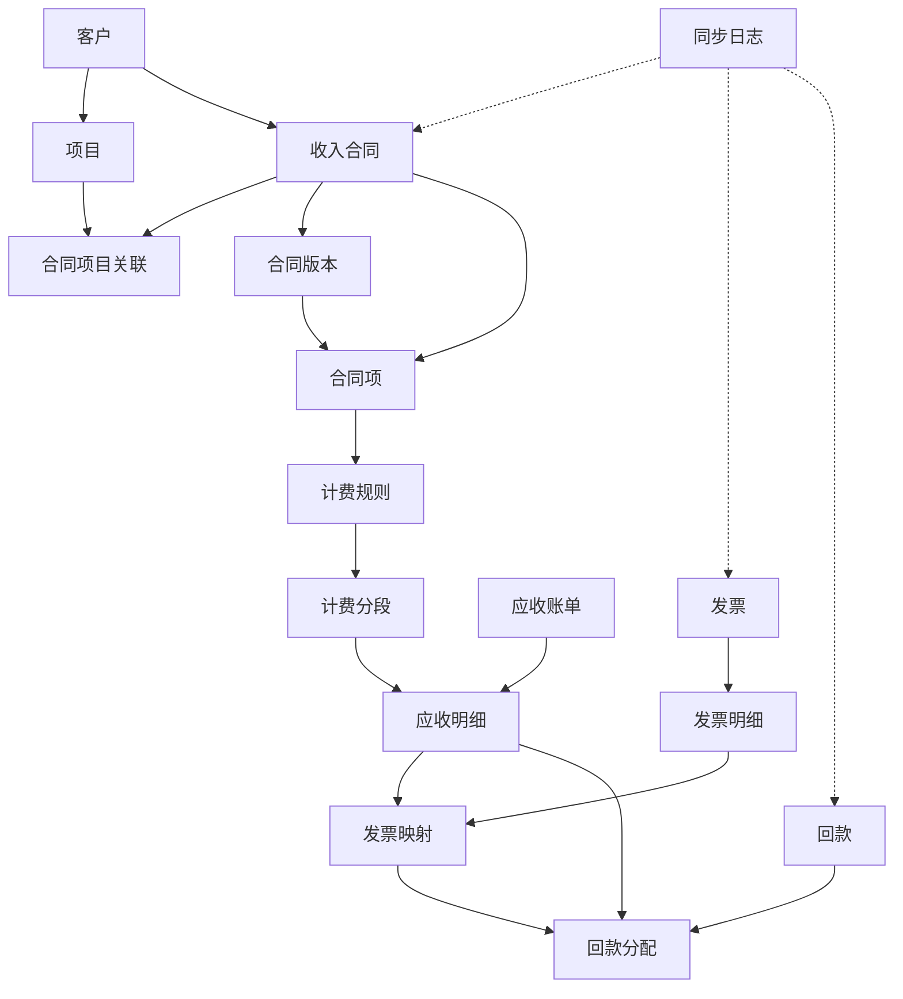

# 收入合同管理系统设计方案

本方案用于 NetBox 插件中的收入合同管理能力。系统定位为经营口径台账，重点管理合同、计费、应收、发票、到款及其映射关系。插件不替代独立财务系统，不处理外币、汇率、涉税、预收账户、预收划拨、红冲、调整单或调整分配。

## 一、系统边界

1. **合同与计费事实源**：本插件维护收入客户、项目、收入合同、合同版本、合同项、计费规则和计费分段。
2. **经营应收事实源**：本插件维护应收账单和应收明细，用于承接合同计费结果。
3. **发票与到款映射事实源**：发票和回款可以来自外部财务系统，也可以在插件内登记；插件负责维护发票明细、发票映射、回款分配与应收明细之间的核销关系。
4. **财务系统边界**：法定账、税务、预收、红冲、坏账审批、资金账户余额等由独立财务系统负责，本插件不建模。

## 二、模型关系

## 三、核心模型

### 1. 客户 `RevenueCustomer`

维护收入合同侧客户主数据，包括客户名称、统一社会信用代码、客户类型、销售负责人、商务负责人、风险标记、财务/EIP 编码等。

### 2. 项目 `RevenueProject`

维护客户下的项目维度，用于合同、合同项、应收账单的归集和统计。

### 3. 收入合同 `RevenueContract`

维护收入合同主数据，包括合同编号、合同名称、客户、合同类型、签约主体、签约日期、生效日期、结束日期、合同金额、是否框架合同、状态、负责人和来源系统。

### 4. 合同项目关联 `RevenueContractProject`

维护合同与项目的多对多关系。一个合同可以归属多个项目，一个项目也可以关联多个合同。

### 5. 合同版本 `RevenueContractVersion`

维护合同原始版本和补充版本，用于保留合同变更历史。合同项和计费规则均应关联到明确版本，避免历史账期被新规则污染。

### 6. 合同项 `RevenueContractLine`

维护具体收费项，包括产品类别、收费项目、单价、数量、单位、生效时间、失效时间和状态。合同项是计费规则和应收生成的基础。

### 7. 计费规则 `RevenueBillingRule`

维护合同项的计费方式，包括规则类型、计费周期、计费方向、出账日、触发事件、折算规则、取整精度和状态。计费周期、计费方向、折算规则均使用枚举字段。

### 8. 计费分段 `RevenueBillingSegment`

记录某个合同项在具体计费期间内的计算结果，包括分段起止日期、单价、数量、金额、触发原因和规则快照。分段用于支撑应收明细的可追溯计算。

### 9. 应收账单 `RevenueReceivableBill`

应收主表，按客户、合同、项目和账期归集应收金额。字段包括账单编号、账期、应收日期、到期日期、原始金额、修正金额、净额、已开票金额、已回款金额、确认状态、开票状态、回款状态、账龄状态和风险状态。

当前不再维护“调整单/调整分配”实体。`adjusted_amount` 仅作为账单或明细上的金额字段保留，用于记录外部确认后的净额修正结果。

### 10. 应收明细 `RevenueReceivableLine`

应收账单的明细行，关联合同项和计费规则，记录服务期间、原始金额、修正金额、净额、风险状态和幂等键。所有发票映射和回款分配最终都应落到应收明细。

### 11. 发票 `RevenueInvoice`

维护发票主表，包括发票代码/号码、客户、发票类型、开票日期、发票金额、来源系统和外部 ID。

### 12. 发票明细 `RevenueInvoiceLine`

维护发票明细行，包括发票、行号、项目名称和金额。发票主表金额必须等于发票明细金额合计。

### 13. 发票映射 `RevenueInvoiceMapping`

维护发票明细与应收明细之间的多对多映射。它回答“这张发票的这条明细覆盖了哪几条应收，以及覆盖多少金额”。

关键约束：

- 同一应收明细下，所有 active 发票映射金额合计不得超过应收明细净额。
- 同一发票明细下，所有 active 发票映射金额合计不得超过发票明细金额。

### 14. 回款 `RevenueReceipt`

维护到账流水，包括客户、到账日期、到账金额、已分配金额、未分配金额、银行流水号、付款方名称、匹配状态、来源系统和外部 ID。

`allocated_total`、`unallocated_amount` 和 `status` 为派生字段，由回款分配保存或删除时自动重算。

### 15. 回款分配 `RevenueReceiptAllocation`

维护回款与应收明细的分配关系，可选关联发票映射。它回答“这笔到账核销了哪条应收，以及是否对应某个发票映射”。

关键约束：

- 回款分配必须关联应收明细。
- 如果关联发票映射，发票映射的应收明细必须与分配记录的应收明细一致。
- 同一发票映射下 active 回款分配金额合计不得超过发票映射金额。

### 16. 同步日志 `RevenueSyncLog`

记录与外部系统交互的同步日志，包括来源系统、实体类型、实体 ID、外部 ID、同步方向、同步状态、请求报文、响应报文和错误信息。

## 四、金额闭合规则

1. 发票金额闭合：`RevenueInvoice.amount = sum(RevenueInvoiceLine.amount)`
2. 应收明细开票上限：`sum(active RevenueInvoiceMapping.mapped_amount) <= RevenueReceivableLine.net_amount`
3. 发票明细映射上限：`sum(active RevenueInvoiceMapping.mapped_amount) <= RevenueInvoiceLine.amount`
4. 发票映射回款上限：`sum(active RevenueReceiptAllocation.allocated_amount where invoice_mapping = current) <= RevenueInvoiceMapping.mapped_amount`
5. 回款未分配金额：`RevenueReceipt.unallocated_amount = RevenueReceipt.amount - sum(active RevenueReceiptAllocation.allocated_amount)`

## 五、核心流程

### 1. 合同建模

先维护客户和项目，再建立收入合同、合同版本和合同项。框架合同可以只登记合同主体和金额，再通过合同项承接实际收费内容。

### 2. 计费生成应收

系统根据合同项和计费规则生成计费分段，再形成应收账单和应收明细。应收明细通过幂等键防止重复生成。

### 3. 发票登记与映射

发票主表和明细登记后，通过发票映射关联到应收明细。一个发票明细可以映射多条应收明细，一条应收明细也可以被多张发票分次覆盖，但不能超过金额上限。

### 4. 回款登记与分配

回款登记后，通过回款分配核销到应收明细。若能确认对应发票，则同时关联发票映射，用于精确计算“已开票未回款”。

### 5. 对账与统计

系统基于应收、发票映射和回款分配输出经营口径统计，包括合同金额、应收金额、已开票金额、已回款金额、未开票金额、未回款金额和已开票未回款金额。

## 六、菜单结构

一级菜单为“合同管理”，二级菜单包括：

- 外购合同
- 收入合同

收入合同下包含：客户、项目、收入合同、合同版本、合同项、计费规则、应收账单、应收明细、发票、发票明细、发票映射、回款、回款分配、同步日志。

## 七、已取消范围

以下能力不在本插件内建模：

- 外币与汇率
- 涉税处理
- 预收账户与预收划拨
- 红冲
- 调整单与调整分配
- 财务总账、资金账户余额和法定账务处理
