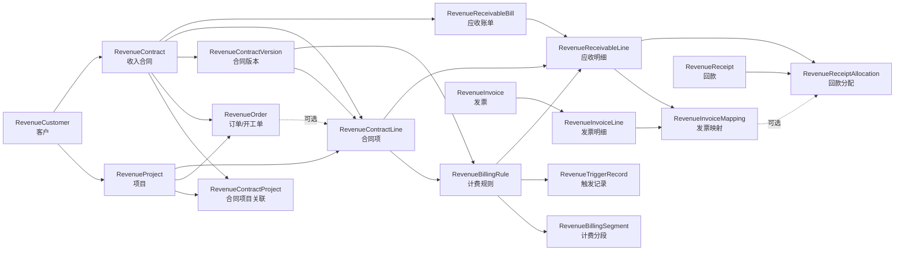
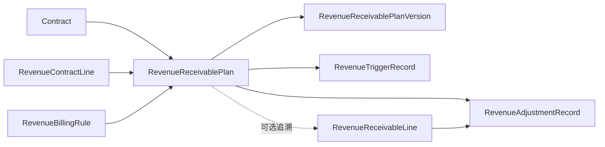

# 收入合同模型说明

本文档按当前代码整理收入合同域的数据模型，面向开发、测试、实施和数据迁移人员。模型定义以 `netbox_contract/models.py` 为准；历史设计方案仅用于理解演进背景。

## 1. 模型范围与业务边界

收入合同域覆盖以下业务链路：

> 客户与项目 → 合同与订单 → 合同版本与合同项 → 计费规则与业务触发 → 应收账单与明细 → 发票映射 → 回款分配

系统保存合同侧的经营事实和应收、开票、回款之间的对应关系，但不是完整的财务总账或税务系统。法定会计凭证、税额计算、银行账户余额等不在本模型范围内。

所有收入域模型都继承 `ContractBaseModel`，因而同时具备 NetBox 模型的通用能力，例如主键、创建/更新时间、自定义字段和标签等。基类在保存前还会把带时区的日期时间统一转换为 UTC。

## 2. 总体关系



应收计划模型是兼容层，不是当前应收生成主链路：



当前主流程由有效计费规则直接驱动：周期性规则按账期生成应收；阶段性和一次性规则由已确认的 `RevenueTriggerRecord` 触发。应收计划及其版本继续保留，用于兼容存量数据和需要显式计划版本的场景。

## 3. 模型清单

| 分组 | 模型 | 作用 |
| --- | --- | --- |
| 主数据 | `RevenueCustomer` | 收入客户主数据 |
| 主数据 | `RevenueProject` | 客户下的项目及累计经营指标 |
| 合同 | `RevenueContract` | 收入合同主表 |
| 合同 | `RevenueContractProject` | 合同与项目的多对多中间表 |
| 合同 | `RevenueOrder` | 框架合同等场景下的订单或开工单 |
| 合同 | `RevenueContractVersion` | 原始合同、补充协议及调价等版本 |
| 合同 | `RevenueContractLine` | 具体收费项和履约期间 |
| 计费 | `RevenueBillingRule` | 周期、阶段或一次性计费规则 |
| 计费 | `RevenueBillingSegment` | 一段计费期间的计算结果与规则快照 |
| 计划兼容 | `RevenueReceivablePlan` | 应收计划主表 |
| 计划兼容 | `RevenueReceivablePlanVersion` | 原计划、当前计划和变更原因 |
| 触发与调整 | `RevenueTriggerRecord` | 已发生的开通、验收或交付事实 |
| 触发与调整 | `RevenueAdjustmentRecord` | SLA 扣款、折扣、退款等调整解释 |
| 应收 | `RevenueReceivableBill` | 按合同、项目和账期归集的应收账单 |
| 应收 | `RevenueReceivableLine` | 可追溯到合同项和计费规则的应收明细 |
| 发票 | `RevenueInvoice` | 发票主表 |
| 发票 | `RevenueInvoiceLine` | 发票明细行 |
| 发票 | `RevenueInvoiceMapping` | 应收明细与发票明细的金额映射 |
| 回款 | `RevenueReceipt` | 银行到账或其他回款记录 |
| 回款 | `RevenueReceiptAllocation` | 回款到应收明细的核销分配 |
| 集成 | `RevenueSyncLog` | 外部系统同步请求、响应和错误日志 |

## 4. 主数据模型

### 4.1 `RevenueCustomer`

客户是项目、合同、应收账单、发票和回款的共同归属主体。

主要字段：

- 识别信息：`name`、`short_name`、`usci`。
- 外部编码：`finance_code`、`eip_code`。
- 业务属性：`customer_type`、`sales_owner`、`business_owner`、`is_risk`。
- 开票与收款资料：`address_phone`、`bank_account`。

约束：

- 客户名称唯一。
- 统一社会信用代码唯一且必填。
- 被项目、合同、应收、发票或回款引用后，删除受 `PROTECT` 保护。

### 4.2 `RevenueProject`

项目属于一个客户，用于合同、订单、合同项和应收的归集与统计。

主要字段：

- 基本信息：`name`、`customer`、`project_type`、`status`。
- 责任人：`project_manager`、`sales_owner`、`business_owner`。
- 累计值：`accumulated_receivable`、`accumulated_invoice`、`accumulated_receipt`。

约束：

- 同一客户下项目名称唯一。
- 合同、订单、合同项和应收引用项目时使用 `PROTECT`。
- 三个累计金额是缓存/汇总字段，不替代应收明细、发票映射和回款分配事实。

## 5. 合同结构模型

### 5.1 `RevenueContract`

合同是收入域的聚合根，保存签约主体、合同期间、金额、责任人和外部同步信息。

主要字段：

- 标识：`contract_code`、`name`。
- 归属与分类：`customer`、`contract_type`、`projects`。
- 签约信息：`our_party`、`customer_party`、`sign_date`、`start_date`、`end_date`。
- 金额与状态：`total_amount`、`is_framework`、`status`。
- 责任与集成：`sales_owner`、`business_owner`、`source_system`、`external_id`、`sync_status`、`sync_log`。

约束与注意事项：

- `contract_code` 全局唯一。
- `total_amount` 可为空，适用于金额未确定的框架合同。
- 删除合同会级联删除合同项目关联、订单、合同版本、合同项和应收计划；已经形成的应收账单使用 `PROTECT`，会阻止删除。
- `contract_type` 与 `is_framework` 是两个独立字段，模型层未强制二者保持一致。

合同类型包括：阶段性 `milestone`、周期性 `recurring`、框架 `framework`、订单 `order`、混合 `hybrid`。

### 5.2 `RevenueContractProject`

该模型实现合同和项目的多对多关系。

- 唯一键为 `contract + project`，同一关联不能重复。
- 删除合同会级联删除关联；删除已关联项目会被阻止。
- 模型本身未校验项目客户与合同客户一致，录入和导入时应由表单、接口或数据质量检查保证。

### 5.3 `RevenueOrder`

订单/开工单用于承接框架合同下的实际下单或开工事实，也可以关联普通合同。

主要字段：

- 标识与归属：`order_code`、`contract`、`project`、`name`。
- 业务事实：`amount`、`start_date`、`end_date`、`status`。
- 集成信息：`source_system`、`external_id`。

约束：

- `contract + project + order_code` 唯一。
- 项目客户必须与合同客户一致。
- 金额不能为负数。
- 结束日期不能早于开始日期。
- 删除合同会级联删除订单；项目和被合同项引用的订单受 `PROTECT` 保护。

### 5.4 `RevenueContractVersion`

合同版本保存合同法律/商务版本的有效期。版本类型包括原始合同、补充协议、调价、延期和终止。

主要字段：`contract`、`version_code`、`change_type`、`start_date`、`end_date`、`status`。

约束：

- 同一合同下 `version_code` 唯一。
- 同一合同最多存在一个 `status=effective` 的版本。
- 删除合同会级联删除版本；已被合同项或计费规则引用的版本不能删除。
- 当前模型未校验版本结束日期是否早于开始日期，也未校验不同版本的有效期是否重叠。

### 5.5 `RevenueContractLine`

合同项是实际收费项目，是计费规则和应收明细的业务基础。

主要字段：

- 归属：`contract`、`contract_version`、`project`。
- 订单：结构化关联 `revenue_order`，以及迁移兼容字段 `order_id`。
- 收费内容：`product_category`、`charge_item`、`unit_price`、`quantity`、`unit`。
- 有效期与状态：`valid_from`、`valid_to`、`status`。

约束：

- 合同版本必须属于所选合同。
- 项目客户必须与合同客户一致。
- 订单必须同时属于所选合同和项目。
- `valid_to` 不能早于 `valid_from`。
- 删除合同会级联删除合同项；版本、项目和订单使用 `PROTECT`。
- `order_id` 仅用于兼容原订单号，新数据优先使用 `revenue_order`。

## 6. 计费、触发与调整模型

### 6.1 `RevenueBillingRule`

计费规则定义合同项何时、以何种方式形成应收。

主要字段：

- 归属：`contract_line`、`contract_version`。
- 规则类型：`rule_type`。
- 事件规则：`trigger_event`、`trigger_offset_days`。
- 周期规则：`billing_cycle`、`billing_direction`、`bill_generation_day`。
- 计算设置：`proration_rule`、`rounding_precision`。
- 启停与审批：`is_active`、`status`。

三种规则的字段组合：

| 规则类型 | 必填字段 | 禁止填写的专属字段 |
| --- | --- | --- |
| 周期性 `recurring` | `billing_cycle`、`billing_direction`、`bill_generation_day` | `trigger_event`，且 `trigger_offset_days` 必须为 0 |
| 阶段性 `milestone` | `trigger_event` | `billing_cycle`、`billing_direction`、`bill_generation_day` |
| 一次性 `one_time` | `trigger_event` | `billing_cycle`、`billing_direction`、`bill_generation_day` |

阶段性或一次性规则在事件确认后，以“实际触发日 + `trigger_offset_days`”作为应收形成日。删除合同项会级联删除规则；合同版本使用 `PROTECT`。

模型层目前未显式校验 `contract_version` 与合同项版本或合同归属一致，也未限制 `bill_generation_day` 的具体日历范围。

### 6.2 `RevenueBillingSegment`

计费分段记录一段期间内的计算结果，主要用于保留价格、数量、金额和规则快照。

主要字段：`contract_line`、`billing_rule`、`segment_start`、`segment_end`、`unit_price`、`quantity`、`amount`、`change_trigger`、`billing_rule_snapshot`。

注意事项：

- `billing_rule_snapshot` 保存生成时的规则内容，避免后续规则变更破坏历史解释。
- 模型层未校验分段日期顺序、金额公式，也未校验规则是否属于合同项。
- 应收明细没有直接外键指向计费分段；二者通过合同项、计费规则和期间进行业务追溯。

### 6.3 `RevenueTriggerRecord`

触发记录保存开通、验收或交付等已经发生的业务事实，是阶段性和一次性规则生成应收的直接依据。

主要字段：`billing_rule`、兼容字段 `plan`、`plan_version`、`trigger_event`、`actual_trigger_date`、`status`、`source_system`、`external_id`、`notes`。

约束：

- `billing_rule` 和 `plan` 至少关联一个。
- 关联计划版本时，该版本必须属于所选计划。
- 同时关联计划和规则时，二者必须指向同一计费规则。
- 直接关联规则时，`trigger_event` 必须与规则配置一致。
- 当前生成逻辑只使用已确认的触发事实；同一规则、同一事件出现多个不同触发日期时会被视为歧义，不生成应收。

### 6.4 `RevenueAdjustmentRecord`

调整记录解释 SLA 扣款、延期赔偿、折扣、退款、红冲/核销等金额变化。

主要字段：`plan`、`receivable_line`、`adjustment_type`、`adjustment_date`、`amount`、`reason`、`source_system`、`external_id`、`status`。

约束：

- 应收计划和应收明细至少关联一个。
- 调整金额不能为 0，可以为正数或负数。
- 同时关联计划和应收明细时，二者必须属于同一合同。

调整记录用于解释金额变化；应收实际净额仍保存在应收账单和应收明细的 `adjusted_amount`、`net_amount` 字段中，模型没有自动把调整记录汇总回写到这些字段。

## 7. 应收计划兼容模型

### 7.1 `RevenueReceivablePlan`

应收计划将合同、合同项和计费规则绑定为一个可版本化的计划对象。

主要字段：`plan_code`、`contract`、`contract_line`、`billing_rule`、`charge_item`、`order_id`、`status`。

约束：

- `plan_code` 全局唯一。
- 合同项必须属于合同。
- 计费规则必须属于合同项。

### 7.2 `RevenueReceivablePlanVersion`

计划版本保存某次计划的触发方式、日期/偏移、金额和变更原因。

主要字段：`plan`、`version_no`、`trigger_type`、`trigger_event`、`offset_days`、`planned_date`、`planned_amount`、`effective_from`、`change_reason`、`is_current`。

约束：

- 同一计划下版本号唯一，且最多一个当前版本。
- 计划金额不能为负数。
- 固定日期 `fixed_date`：只能填写 `planned_date`。
- 条件触发 `trigger_offset`：必须填写 `trigger_event` 和 `offset_days`，不能填写计划日期。
- 预计日期 `estimated_date`：必须填写 `planned_date`，不能填写偏移天数；`trigger_event` 可保留。

## 8. 应收模型

### 8.1 `RevenueReceivableBill`

应收账单是应收主表，通常按客户、合同、项目和账期归集。

主要字段：

- 标识与归属：`bill_code`、`customer`、`contract`、`project`、`billing_period`。
- 日期：`receivable_date`、`due_date`。
- 金额：`amount`、`adjusted_amount`、`net_amount`、`invoiced_amount`、`receipted_amount`。
- 状态：`confirm_status`、`invoice_status`、`receipt_status`、`ageing_status`、`risk_status`。

金额口径：

```text
应收净额 net_amount = 原始金额 amount + 修正金额 adjusted_amount
```

账单级的 `invoiced_amount`、`receipted_amount` 是缓存/汇总值。需要准确核对时，应分别根据有效的 `RevenueInvoiceMapping` 和有效的 `RevenueReceiptAllocation` 汇总。

当前模型未在 `clean()` 中校验账单金额公式、日期顺序或客户/项目与合同的一致性；这些规则应在生成服务、接口校验和数据质量检查中共同保证。

### 8.2 `RevenueReceivableLine`

应收明细是开票和回款核销的最小业务单元。

主要字段：

- 归属：`bill`、`contract_line`、`billing_rule`，以及可选的 `receivable_plan`。
- 期间与日期：`start_date`、`end_date`、`receivable_date`、`due_date`。
- 金额与风险：`amount`、`adjusted_amount`、`net_amount`、`risk_status`。
- 幂等控制：`idempotent_key`。

约束：

- `idempotent_key` 全局唯一，防止同一规则、合同项和账期/触发事实重复生成。
- `due_date` 不能早于 `receivable_date`。
- `net_amount` 必须等于 `amount + adjusted_amount`。
- 关联应收计划时，计划必须同时属于所选合同项、计费规则和账单合同。

`receivable_date`、`due_date` 在明细层可为空以兼容历史数据；展示时优先使用明细日期，没有时才适合回退到账单日期。

## 9. 发票模型

### 9.1 `RevenueInvoice`

发票主表保存客户、票据形式、开票日期、总金额和外部系统同步信息。

主要字段：`invoice_code`、`customer`、`invoice_type`、`invoice_date`、`amount`、`source_system`、`external_id`、`sync_status`、`sync_log`。

约束：

- `invoice_code` 全局唯一。
- 已保存发票执行 `full_clean()` 时，发票总金额必须等于明细金额合计。
- 创建尚无明细的发票时不会执行该相等性检查；推荐先保存主表、录入明细，再对主表执行完整校验。

### 9.2 `RevenueInvoiceLine`

主要字段：`invoice`、`line_no`、`external_line_id`、`item_name`、`amount`。

约束：

- 同一发票下 `line_no` 唯一。
- 删除发票会级联删除发票明细。

### 9.3 `RevenueInvoiceMapping`

发票映射是应收明细与发票明细之间的金额桥接表，支持一条应收拆分到多条发票明细，也支持一条发票明细覆盖多条应收。

主要字段：`receivable_line`、`invoice_line`、`mapped_amount`、`status`、`operator`、`approval_batch_no`。

有效状态下的约束：

- 同一“应收明细 + 发票明细”最多一条有效映射。
- 某应收明细的有效映射金额合计不能超过该应收明细净额。
- 某发票明细的有效映射金额合计不能超过该发票明细金额。

解绑通过把状态改为 `unmapped` 实现，保留历史记录。应收明细和发票明细均使用 `PROTECT`，存在映射时不能删除。

## 10. 回款模型

### 10.1 `RevenueReceipt`

回款主表保存银行流水或其他到账事实。

主要字段：

- 归属与到账：`customer`、`receipt_date`、`amount`、`bank_flow_no`、`payer_name`。
- 派生结果：`allocated_total`、`unallocated_amount`、`status`。
- 集成：`source_system`、`external_id`、`sync_status`、`sync_log`。

派生口径：

```text
已分配金额 allocated_total = 有效回款分配金额合计
待分配余额 unallocated_amount = 到账金额 amount - allocated_total
```

`update_totals()` 根据有效分配自动更新状态：

- 已分配为 0：`unmatched`。
- 已分配小于到账金额：`partially_allocated`。
- 已分配等于到账金额：`fully_allocated`。

数据库约束要求待分配余额不能为负数。

### 10.2 `RevenueReceiptAllocation`

回款分配把一笔到账金额核销到具体应收明细，并可选关联一条发票映射。

主要字段：`receipt`、`receivable_line`、`invoice_mapping`、`allocated_amount`、`allocation_type`、`status`、`operator`、`approval_batch_no`。

有效状态下的约束：

- 分配金额必须大于 0。
- 必须关联应收明细。
- 关联发票映射时，映射中的应收明细必须与分配记录一致。
- 同一回款的有效分配合计不能超过到账金额。
- 同一应收明细的有效分配合计不能超过应收净额。
- 同一发票映射的有效分配合计不能超过映射金额。

该模型的 `save()` 会主动执行 `full_clean()`，并在事务内保存后重算回款汇总；删除分配后也会重算。回款、应收明细和发票映射均使用 `PROTECT`，以保留核销链路。

## 11. 同步日志模型

### `RevenueSyncLog`

同步日志不通过外键直接绑定业务模型，而是使用 `entity_type + entity_id` 记录本地实体，用 `external_id` 记录外部实体。

主要字段：

- 定位：`source_system`、`entity_type`、`entity_id`、`external_id`。
- 方向与结果：`sync_direction`、`sync_status`。
- 报文与错误：`request_payload`、`response_payload`、`error_message`。

这种设计避免同步日志阻止业务对象删除，但数据库无法检查 `entity_id` 是否真实存在。查询、清理和审计同步日志时需要按 `entity_type` 解释 `entity_id`。

## 12. 关键枚举

| 领域 | 字段 | 可选值 |
| --- | --- | --- |
| 客户 | `customer_type` | `operator`、`enterprise`、`integrator`、`internal` |
| 项目 | `project_type` | `fiber`、`circuit`、`idc`、`rack`、`pipe`、`composite` |
| 合同 | `contract_type` | `milestone`、`recurring`、`framework`、`order`、`hybrid` |
| 合同版本 | `change_type` | `original`、`supplement`、`repricing`、`extension`、`termination` |
| 计费 | `rule_type` | `milestone`、`recurring`、`one_time` |
| 触发 | `trigger_event` | `activation`、`acceptance`、`delivery` |
| 周期 | `billing_cycle` | `month`、`quarter`、`year` |
| 方向 | `billing_direction` | `postpay`、`prepay` |
| 折算 | `proration_rule` | `actual_days`、`full_month`、`none` |
| 应收确认 | `confirm_status` | `draft`、`confirmed`、`canceled` |
| 开票进度 | `invoice_status` | `uninvoiced`、`partially_invoiced`、`fully_invoiced` |
| 回款进度 | `receipt_status` | `unpaid`、`partially_paid`、`fully_paid` |
| 账龄 | `ageing_status` | `not_due`、`overdue` |
| 风险 | `risk_status` | `normal`、`waived`、`bad_debt` |
| 来源系统 | `source_system` | `SAMPLE_DATA`、`LEGACY_LEDGER`、`REVENUE_SYS`、`BANK_FLOW` |

完整枚举及中文标签以 `models.py` 中对应的 `ChoiceSet` 为准。

## 13. 删除策略与数据完整性

模型采用两类删除策略：

- `CASCADE`：父对象消失后，纯从属对象也失去意义。例如合同项目关联、合同订单、合同版本、合同项、计费规则、应收计划、账单明细和发票明细。
- `PROTECT`：对象已经成为跨流程事实或历史依据时禁止删除。例如项目、合同版本、订单、计费规则、应收明细、发票明细和回款分配链路。

建议业务上优先使用状态关闭、取消、解绑或作废，避免直接删除已经进入计费、应收、开票或回款链路的数据。

## 14. 校验执行注意事项

Django 的 `save()` 默认不会自动调用 `full_clean()`。除 `RevenueReceiptAllocation.save()` 已显式调用外，其他模型中的 `clean()` 规则只有在以下路径才会执行：

- NetBox/Django 表单正常提交；
- DRF 序列化器显式校验；
- 业务代码主动调用 `full_clean()`；
- 测试或导入脚本主动调用校验。

因此批量导入、脚本写入和直接调用 ORM `create()` 时，不能假设模型级 `clean()` 自动生效。导入代码应主动校验，数据库唯一约束和检查约束则始终生效。

## 15. 当前主流程

1. 建立客户、项目和收入合同。
2. 建立合同版本、合同项；框架合同可先建立订单/开工单。
3. 为合同项配置有效计费规则。
4. 周期性规则按账期直接计算；阶段性和一次性规则等待已确认触发记录。
5. 生成计费分段、应收账单和带唯一幂等键的应收明细。
6. 录入或同步发票及发票明细，通过发票映射覆盖应收明细。
7. 录入或同步回款，通过回款分配核销应收明细，并按需关联发票映射。
8. 根据有效映射和有效分配计算开票、回款和逾期指标；账单缓存字段用于对账，不应作为唯一事实来源。

## 16. 代码定位

- 模型与枚举：`netbox_contract/models.py`
- 应收生成：`netbox_contract/services/revenue_generation.py`
- 应收事件与指标：`netbox_contract/services/revenue_events.py`
- 合同组合视图数据：`netbox_contract/services/revenue_views.py`
- 模型及链路测试：`netbox_contract/tests/test_revenue_models.py`
- 生成规则测试：`netbox_contract/tests/test_revenue_generation.py`
- 收入模型初始迁移：`netbox_contract/migrations/0048_revenuebillingrule_revenuecontract_and_more.py`
- 规则直驱与触发迁移：`netbox_contract/migrations/0056_rule_driven_receivable_triggers.py`
